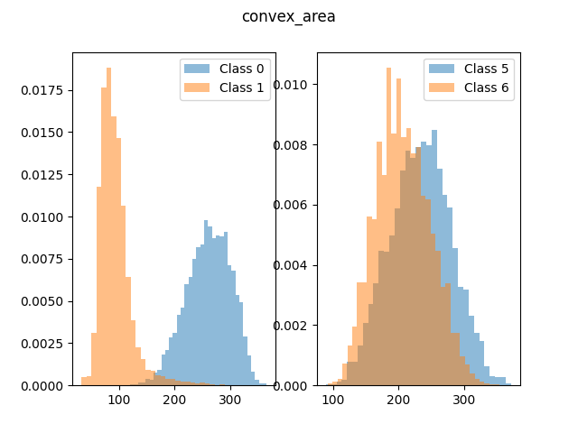

# Neural network from scratch vs Fisher's Discriminant

## Coding a neural network from scratch

Study of the MNIST handwritten digit database. This dataset is used for two different learning methods to classify the handwritten digits into their corresponding label.
 - Fisher discriminant between two classes to separate the images based on relevant features
 - neural network: classification based on the pixels of the images. 
 
All functions, besides for feature extraction, are coded "by scratch", meaning not using any built-in functions 

___ 

### Fisher Discriminant 

Files:
- fisher.py: computation
- plot_fisher.py: plotting figures

This first method is based on the study of the average image of each class, such as the following:

From these images, we can extract features using measure from the skimage package: 

A decision can then be made using one or multiple properties by Fisher Discriminant analysis

___ 
### Neural Networks

Files:
- neural.py: computation
- plot_neural.py: plotting figures

Implementing the equation of a simple neural network to discriminate between two digits. The idea is to have as few neurons as possible,
and optimize all other parameters (learning rate, number of epochs, activation functions, etc.) to increase the accuracy.

